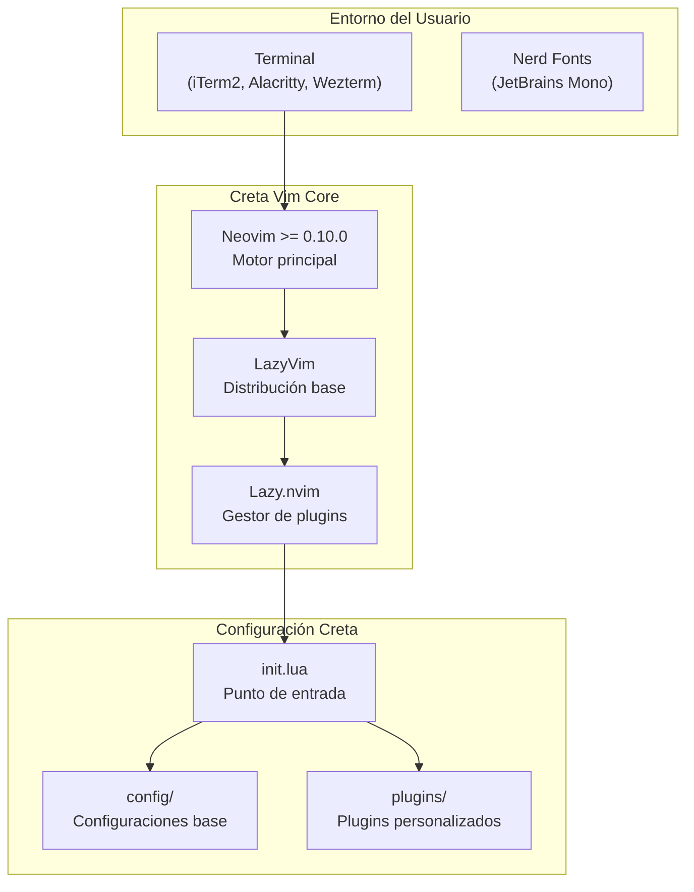

# Creta Vim

[](https://opensource.org/licenses/MIT)
[](https://neovim.io/)
[](https://lazyvim.org/)
[](https://icarus.mx)

**Configuración oficial de Neovim para estudiantes de Icarus**

Creta Vim es una distribución de [LazyVim](https://lazyvim.org) optimizada para el stack de Icarus, con tema personalizado, plugins esenciales y documentación en español.

> "Salgamos de este laberinto" 🏛️

---

## Descripción

Creta Vim transforma Neovim en un entorno de desarrollo moderno y potente, diseñado específicamente para desarrolladores que trabajan con SvelteKit 5, Tailwind CSS 4 y JavaScript/Node.js. Como estudiante de Icarus, tendrás acceso a una configuración profesional sin la complejidad de construirla desde cero.

**Por qué usar Creta Vim:**

- **Configuración Zero-Config**: Funciona perfectamente desde el primer momento, sin horas de configuración
- **Optimizado para Icarus Stack**: LSP pre-configurados para SvelteKit, Tailwind y Node.js
- **Documentación en Español**: Aprende Vim en tu idioma con tutoriales integrados
- **Extensible**: Añade tus propios plugins y configuraciones fácilmente
- **Rendimiento**: Carga en menos de 100ms con lazy loading inteligente
- **Mantenido activamente**: Actualizaciones regulares con las últimas herramientas

---

## Características

### Estética Icarus
- **Tema**: Kanagawa Wave con modo transparente elegante
- **Welcome screen**: Pantalla de bienvenida personalizada de Creta
- **Iconos**: Nerd Fonts con símbolos cuidadosamente seleccionados
- **Interfaz moderna**: Statusline, bufferline y file explorer integrados

### Optimizado para el Stack de Icarus
- **SvelteKit 5**: Syntax highlighting avanzado, LSP completo, snippets útiles
- **Tailwind CSS 4**: Autocompletado inteligente, preview de colores inline
- **JavaScript/Node.js**: ESLint integrado, Prettier formatting, debugging
- **Git**: Lazygit integrado, indicadores visuales de cambios

### Plugins Pre-configurados
- **Telescope**: Búsqueda ultrarrápida de archivos y texto (fuzzy finder)
- **Neo-tree**: Explorador de archivos con vista de árbol
- **Gitsigns**: Indicadores de Git en el gutter con preview de cambios
- **Markdown**: Renderizado inline + preview con Glow (Shift+L)
- **LSP**: Servidores configurados para TypeScript, Svelte, Tailwind, Lua
- **Treesitter**: Syntax highlighting contextual y navegación de código
- **Which-key**: Ayuda contextual de keybindings
- **Mason**: Gestión automática de LSP servers

### Documentación en Español
- Cheatsheet de keybindings esenciales
- Tutoriales integrados para nuevos usuarios
- Mensajes de ayuda traducidos
- README completo con ejemplos prácticos

---

## Arquitectura

Creta Vim está construido sobre una arquitectura modular que facilita la personalización y el mantenimiento:

### Diagrama de Arquitectura del Sistema



[Ver diagrama completo de arquitectura](docs/system-architecture.mmd)

### Flujo de Inicialización

Cuando ejecutas `nvim`, Creta Vim realiza el siguiente flujo:

1. **Bootstrap**: Verifica e instala Lazy.nvim si es necesario
2. **Carga de configuración**: Importa LazyVim base y plugins personalizados
3. **Sincronización de plugins**: Descarga plugins faltantes (solo primera vez)
4. **Instalación de LSP**: Mason instala servidores LSP automáticamente
5. **Renderizado**: Muestra el dashboard de bienvenida con estadísticas

[Ver diagrama de secuencia detallado](docs/sequence-diagram.mmd)

### Estructura de Interfaces

La configuración sigue una estructura modular basada en archivos Lua:

[Ver diagrama de interfaces principales](docs/main-interfaces.mmd)

---

## Requisitos

### Obligatorios
- **Neovim** >= 0.10.0 - [Descargar](https://neovim.io/)
- **Git** >= 2.19.0 - [Descargar](https://git-scm.com/)
- **Node.js** >= 18.0.0 - [Descargar](https://nodejs.org/) (para LSP servers)

### Recomendados
- **Nerd Font** - [JetBrains Mono](https://www.nerdfonts.com/font-downloads) o similar
- **Terminal con true color** - iTerm2, Alacritty, Wezterm, Kitty
- **Glow** (opcional) - Para preview de Markdown: `brew install glow`
- **Lazygit** (opcional) - Git UI integrado: `brew install lazygit`

### Verificar instalación

```bash
# Verificar versión de Neovim
nvim --version

# Verificar Node.js
node --version

# Verificar Git
git --version
```

---

## Instalación

### Opción 1: Instalación Limpia (Recomendado para nuevos usuarios)

Si es tu primera vez con Neovim o quieres empezar de cero:

```bash
# 1. Respaldar configuración actual (si existe)
mv ~/.config/nvim ~/.config/nvim.backup.$(date +%Y%m%d)
mv ~/.local/share/nvim ~/.local/share/nvim.backup.$(date +%Y%m%d)

# 2. Clonar Creta Vim
git clone https://github.com/icarusmx/creta-vim.git ~/.config/nvim

# 3. Abrir Neovim (instalará plugins automáticamente)
nvim
```

**Qué esperar en el primer inicio:**

1. Lazy.nvim se instalará automáticamente (~10 segundos)
2. Todos los plugins se descargarán (~2 minutos)
3. Mason instalará LSP servers en segundo plano (~1-2 minutos)
4. Verás el dashboard de Creta Vim
5. Presiona `q` cuando termine la instalación
6. Reinicia Neovim: `:q` y vuelve a abrir `nvim`

### Opción 2: Instalación con Script

Usa el script automatizado que incluye verificaciones de dependencias:

```bash
# Clonar repositorio
git clone https://github.com/icarusmx/creta-vim.git ~/creta-vim-temp

# Ejecutar instalador
cd ~/creta-vim-temp
chmod +x install.sh
./install.sh
```

El script:
- Verifica que Neovim, Git y Node.js estén instalados
- Crea respaldos automáticos de tu configuración actual
- Instala Creta Vim en `~/.config/nvim`
- Ejecuta la sincronización inicial de plugins

### Opción 3: Probar sin Afectar tu Configuración

Si ya usas Neovim y quieres probar Creta Vim sin tocar tu setup:

```bash
# Clonar en directorio temporal
git clone https://github.com/icarusmx/creta-vim.git ~/creta-vim-test

# Abrir con configuración aislada
NVIM_APPNAME=creta-vim-test nvim
```

Esto crea una instalación completamente independiente. Tu configuración actual no se toca.

Para volver a tu configuración normal, simplemente abre `nvim` sin la variable de entorno.

### Post-Instalación

Después de instalar, verifica que todo funcione correctamente:

```vim
:checkhealth        " Diagnóstico completo del sistema
:Lazy               " Ver estado de plugins
:Mason              " Ver LSP servers instalados
:LspInfo            " Verificar LSP activos (abre un archivo primero)
```

---

## Uso

### Primera Sesión: Flujo Básico

Aquí está tu primer flujo de trabajo con Creta Vim:

```bash
# 1. Abrir Neovim
nvim

# 2. Verás el dashboard de Creta Vim
# Presiona 'f' para buscar archivos o 'n' para nuevo archivo

# 3. Buscar un archivo con Telescope
# Presiona Space Space, escribe el nombre, Enter

# 4. Entrar en modo Insert para editar
# Presiona 'i' y empieza a escribir

# 5. Guardar cambios
# Presiona Esc, luego escribe :w y Enter

# 6. Salir
# Escribe :q y Enter
```

### Keybindings Esenciales

#### General
| Keybinding | Acción | Descripción |
|------------|--------|-------------|
| `<leader>` | Space | Tecla líder para todos los comandos |
| `<leader><leader>` | Buscar archivos | Abre Telescope para búsqueda rápida |
| `<leader>e` | Toggle file explorer | Muestra/oculta Neo-tree |
| `<leader>ff` | Find files | Buscar archivos por nombre |
| `<leader>fg` | Find text (grep) | Buscar texto en todo el proyecto |
| `<leader>fb` | Find buffers | Buscar entre archivos abiertos |
| `<leader>fh` | Find help | Buscar en la documentación |
| `:Lazy` | Gestor de plugins | Ver y actualizar plugins |
| `:Mason` | Gestor de LSP | Instalar/actualizar LSP servers |

#### Navegación
| Keybinding | Acción | Descripción |
|------------|--------|-------------|
| `Ctrl+h/j/k/l` | Navegar ventanas | Moverse entre splits |
| `<leader>sv` | Split vertical | Dividir ventana verticalmente |
| `<leader>sh` | Split horizontal | Dividir ventana horizontalmente |
| `gd` | Go to definition | Ir a la definición del símbolo |
| `gr` | Go to references | Ver todas las referencias |
| `K` | Hover documentation | Mostrar documentación del símbolo |
| `Ctrl+o` | Jump back | Volver a posición anterior |
| `Ctrl+i` | Jump forward | Ir a posición siguiente |

#### Edición
| Keybinding | Acción | Descripción |
|------------|--------|-------------|
| `gcc` | Toggle comment line | Comentar/descomentar línea actual |
| `gc` (visual) | Toggle comment selection | Comentar bloque seleccionado |
| `<leader>ca` | Code actions | Ver acciones disponibles (refactors, fixes) |
| `<leader>rn` | Rename symbol | Renombrar símbolo en todo el proyecto |
| `<leader>cf` | Format document | Formatear archivo con Prettier |
| `[d` / `]d` | Previous/next diagnostic | Navegar entre errores/warnings |

#### Git
| Keybinding | Acción | Descripción |
|------------|--------|-------------|
| `<leader>gg` | Open Lazygit | Abrir interfaz de Git completa |
| `]h` | Next hunk | Siguiente cambio en Git |
| `[h` | Previous hunk | Anterior cambio en Git |
| `<leader>gp` | Preview hunk | Preview del cambio actual |
| `<leader>gb` | Git blame | Ver quién modificó la línea |

#### Markdown (solo en archivos .md)
| Keybinding | Acción | Descripción |
|------------|--------|-------------|
| `Shift+L` | Preview con Glow | Abrir preview del Markdown |

### Trabajar con SvelteKit

Creta Vim está optimizado para SvelteKit 5. Al abrir un archivo `.svelte`:

**Autocompletado inteligente:**
```svelte
<script>
  let count = 0;
  // Escribe 'co' y presiona Ctrl+Space para ver sugerencias
</script>

<button on:click={() => count++}>
  <!-- Autocompletado de eventos, props, etc. -->
</button>
```

**Diagnósticos en tiempo real:**
- Errores de TypeScript/JavaScript subrayados
- Warnings de accesibilidad (configurados como info, no molestos)
- Sugerencias de Svelte compiler

**Navegación rápida:**
- `gd` sobre un componente te lleva a su definición
- `K` muestra la documentación del símbolo bajo el cursor

### Trabajar con Tailwind CSS

El LSP de Tailwind provee:

**Preview de colores:**
```html
<!-- Verás el color real al lado de la clase -->
<div class="bg-blue-500 text-white">
  <!-- bg-blue-500 mostrará un cuadro azul -->
</div>
```

**Autocompletado:**
```html
<div class="flex
<!-- Presiona Ctrl+Space para ver todas las clases flex-* -->
```

**Hover para ver valores CSS:**
- Coloca el cursor sobre una clase Tailwind
- Presiona `K` para ver el CSS generado

---

## Guía para Estudiantes de Icarus

### Primer Día con Creta Vim

**1. Familiarízate con los modos de Vim:**

Vim tiene diferentes "modos" de operación. Esto puede parecer confuso al principio, pero es lo que hace a Vim tan potente:

- **Normal** - Para navegar y ejecutar comandos (presiona `Esc` para volver aquí)
- **Insert** - Para escribir texto (presiona `i`, `a`, o `o` para entrar)
- **Visual** - Para seleccionar texto (presiona `v` para entrar)
- **Command** - Para ejecutar comandos (presiona `:` para entrar)

**Regla de oro:** Cuando no sepas qué hacer, presiona `Esc` para volver a modo Normal.

**2. Practica navegación básica:**

En modo Normal, puedes moverte sin tocar el mouse:

```
h j k l  →  ← ↓ ↑ (izquierda, abajo, arriba, derecha)
w        →  Siguiente palabra
b        →  Palabra anterior
gg       →  Inicio del archivo
G        →  Fin del archivo
Ctrl+d   →  Media página abajo
Ctrl+u   →  Media página arriba
0        →  Inicio de línea
$        →  Fin de línea
```

**3. Tu primer flujo de trabajo completo:**

```vim
1. nvim                      " Abrir Neovim en el directorio actual
2. Space Space               " Buscar archivo con Telescope
3. Escribe: "App.svelte"     " Escribe el nombre del archivo
4. Enter                     " Abrir el archivo
5. i                         " Entrar a modo Insert
6. (editar tu código)        " Haz cambios
7. Esc                       " Volver a modo Normal
8. :w                        " Guardar (write)
9. Space e                   " Ver el árbol de archivos
10. Space Space              " Abrir otro archivo
11. :q                       " Salir (quit)
```

**4. Errores comunes y cómo solucionarlos:**

| Problema | Solución |
|----------|----------|
| "No puedo escribir" | Presiona `i` para entrar a modo Insert |
| "Aparecen letras raras al mover" | Estás en modo Insert, presiona `Esc` |
| "No se guarda el archivo" | Asegúrate de estar en modo Normal (Esc) y escribe `:w` |
| "Cómo salgo de Vim?" | Modo Normal (Esc), luego `:q` (o `:q!` para salir sin guardar) |

### Tutoriales Incluidos

Creta Vim incluye tutoriales interactivos. Ejecútalos desde dentro de Neovim:

```vim
:Tutor          " Tutorial oficial de Vim (en español cuando esté disponible)
:help creta     " Ayuda de Creta Vim
:help <leader>  " Ayuda sobre la tecla líder
```

### Progresión de Aprendizaje Recomendada

**Semana 1: Sobrevivir**
- Aprender los modos (Normal, Insert, Visual)
- Navegar con h, j, k, l
- Guardar `:w` y salir `:q`
- Buscar archivos con `Space Space`

**Semana 2: Ser productivo**
- Movimientos rápidos: `w`, `b`, `gg`, `G`
- Edición básica: `dd` (borrar línea), `yy` (copiar línea), `p` (pegar)
- Buscar en archivo: `/texto` y `n` para siguiente
- Usar LSP: `gd` (go to definition), `K` (documentación)

**Semana 3: Dominar el flujo**
- Visual mode: `v` para seleccionar, `V` para líneas
- Edición múltiple: `.` para repetir, macros básicas
- Git workflow: `<leader>gg` para Lazygit
- Personalizar: agregar tu primer plugin

**Mes 2 en adelante: Experto**
- Macros avanzadas: `q{letra}` para grabar, `@{letra}` para reproducir
- Splits y ventanas: trabajar con múltiples archivos
- Vim motions complejas: `ci"`, `da{`, `yiw`
- Crear tus propios keybindings y funciones

---

## Personalización

Creta Vim está diseñado para ser tu punto de partida, no tu punto final. Aquí te mostramos cómo personalizarlo:

### Cambiar el Tema

Edita `~/.config/nvim/lua/plugins/colorscheme.lua`:

```lua
return {
  {
    "rebelot/kanagawa.nvim",
    opts = {
      theme = "dragon",        -- Cambiar a "dragon" para más oscuro
      transparent = false,     -- false para fondo sólido
      background = {
        dark = "wave",         -- Tema para modo oscuro
        light = "lotus"        -- Tema para modo claro
      },
    },
  },
}
```

**Temas alternativos populares:**

```lua
-- Tokyo Night (azul vibrante)
return {
  { "folke/tokyonight.nvim" },
  {
    "LazyVim/LazyVim",
    opts = { colorscheme = "tokyonight-night" }
  }
}

-- Catppuccin (pastel suave)
return {
  { "catppuccin/nvim", name = "catppuccin" },
  {
    "LazyVim/LazyVim",
    opts = { colorscheme = "catppuccin-mocha" }
  }
}

-- Rose Pine (minimalista)
return {
  { "rose-pine/neovim", name = "rose-pine" },
  {
    "LazyVim/LazyVim",
    opts = { colorscheme = "rose-pine" }
  }
}
```

Después de editar, reinicia Neovim o ejecuta `:Lazy sync`.

### Agregar Nuevos Plugins

Crea un archivo en `~/.config/nvim/lua/plugins/mi-plugin.lua`:

```lua
return {
  {
    "usuario/nombre-del-plugin",
    -- Especificar cuándo cargar (opcional)
    event = "VeryLazy",  -- Cargar después del startup
    -- o
    -- keys = "<leader>p",  -- Cargar al presionar el keybinding
    -- o
    -- ft = "python",  -- Cargar solo para archivos Python

    -- Configuración del plugin
    opts = {
      -- opciones aquí
    },

    -- O configuración manual
    config = function()
      require("plugin").setup({
        opcion = true
      })
    end,
  },
}
```

**Ejemplo real - Agregar soporte para Python:**

```lua
-- ~/.config/nvim/lua/plugins/python.lua
return {
  -- Treesitter para Python
  {
    "nvim-treesitter/nvim-treesitter",
    opts = function(_, opts)
      vim.list_extend(opts.ensure_installed, { "python" })
    end,
  },

  -- LSP para Python
  {
    "neovim/nvim-lspconfig",
    opts = {
      servers = {
        pyright = {},  -- Python LSP
      },
    },
  },

  -- Asegurar que Pyright esté instalado
  {
    "williamboman/mason.nvim",
    opts = function(_, opts)
      opts.ensure_installed = opts.ensure_installed or {}
      vim.list_extend(opts.ensure_installed, { "pyright", "black" })
    end,
  },
}
```

### Personalizar Keybindings

Edita `~/.config/nvim/lua/config/keymaps.lua`:

```lua
-- Añadir tus propios keybindings
local keymap = vim.keymap

-- Ejemplo: Ctrl+s para guardar en cualquier modo
keymap.set({ "n", "i", "v" }, "<C-s>", "<cmd>w<cr>", { desc = "Guardar archivo" })

-- Ejemplo: Leader+y para copiar al clipboard del sistema
keymap.set({ "n", "v" }, "<leader>y", '"+y', { desc = "Copiar a clipboard" })

-- Ejemplo: jk para salir de Insert mode
keymap.set("i", "jk", "<Esc>", { desc = "Salir de Insert mode" })

-- Ejemplo: Navegación entre buffers más fácil
keymap.set("n", "<Tab>", ":bnext<CR>", { desc = "Siguiente buffer" })
keymap.set("n", "<S-Tab>", ":bprevious<CR>", { desc = "Buffer anterior" })
```

### Personalizar Opciones de Vim

Edita `~/.config/nvim/lua/config/options.lua`:

```lua
-- Opciones personalizadas de Vim
local opt = vim.opt

-- Números relativos (útil para movimientos)
opt.relativenumber = true

-- Tamaño de indentación
opt.tabstop = 4      -- Ancho visual del tab
opt.shiftwidth = 4   -- Espacios para auto-indent
opt.expandtab = true -- Usar espacios en lugar de tabs

-- Desactivar wrap de líneas largas
opt.wrap = false

-- Scroll offset (líneas visibles arriba/abajo del cursor)
opt.scrolloff = 10

-- Resaltar la línea actual
opt.cursorline = true

-- Columna de guía en columna 80
opt.colorcolumn = "80"
```

### Crear un Plugin Personal

Para experimentar sin miedo, crea `~/.config/nvim/lua/plugins/personal.lua` (este archivo está en `.gitignore`, no se compartirá en Git):

```lua
-- Tus experimentos y configuraciones personales
return {
  -- Prueba plugins aquí
  {
    "plugin/experimental",
    enabled = false,  -- Deshabilitado por defecto
  },
}
```

---

## Estructura del Proyecto

```
~/.config/nvim/
├── init.lua                   # Punto de entrada, carga config/lazy.lua
├── install.sh                 # Script de instalación automatizado
├── LICENSE                    # Licencia MIT
├── README.md                  # Esta documentación (español)
├── .gitignore                 # Archivos ignorados por Git
│
├── lua/
│   ├── config/               # Configuraciones base de Neovim
│   │   ├── lazy.lua          # Setup de Lazy.nvim + LazyVim
│   │   ├── options.lua       # Opciones de Vim (heredadas de LazyVim)
│   │   ├── keymaps.lua       # Keybindings personalizados
│   │   └── autocmds.lua      # Auto-comandos (eventos automáticos)
│   │
│   └── plugins/              # Plugins personalizados de Creta
│       ├── colorscheme.lua   # Tema Kanagawa con transparencia
│       ├── creta.lua         # Dashboard + LSP auto-install (Mason)
│       ├── svelte.lua        # SvelteKit 5 support (Treesitter + LSP)
│       ├── tailwind.lua      # Tailwind CSS 4 support
│       ├── markdown.lua      # Markdown preview con Glow
│       ├── example.lua       # Plantilla para nuevos plugins
│       └── personal.lua      # Tu archivo personal (gitignored)
│
└── docs/                     # Documentación técnica
    ├── system-architecture.mmd   # Diagrama de arquitectura
    ├── sequence-diagram.mmd      # Flujo de inicialización
    └── main-interfaces.mmd       # Estructura de interfaces
```

**Archivos clave:**

- **init.lua**: Ejecuta `require("config.lazy")` para iniciar todo
- **config/lazy.lua**: Configura Lazy.nvim e importa LazyVim + plugins personalizados
- **plugins/creta.lua**: Define el dashboard de Creta y LSP servers esenciales
- **plugins/*.lua**: Cada archivo es un plugin o conjunto de plugins relacionados

**Flujo de carga:**

```
nvim → init.lua → config/lazy.lua → LazyVim + plugins/* → Dashboard
```

---

## Solución de Problemas

### Problemas Comunes

#### LSP no funciona / No hay autocompletado

**Síntomas:** No aparecen sugerencias, no hay diagnósticos, `gd` no funciona

**Solución:**

```vim
:Mason
" Verifica que estén instalados:
" - vtsls (TypeScript/JavaScript)
" - svelte-language-server (Svelte)
" - tailwindcss-language-server (Tailwind)

" Si faltan, búscalos en Mason (presiona 'i' para instalar)
```

Para verificar si el LSP está activo en el archivo actual:

```vim
:LspInfo
" Deberías ver el servidor correcto conectado
```

#### Iconos no se ven bien / Aparecen cuadros

**Síntomas:** Ves `□`, `?` o símbolos raros en lugar de iconos

**Solución:**

1. Instala una Nerd Font: https://www.nerdfonts.com/font-downloads
2. Descarga "JetBrains Mono Nerd Font" (recomendado)
3. Instala la fuente en tu sistema
4. Configura tu terminal para usar esa fuente:
   - **iTerm2**: Preferences → Profiles → Text → Font
   - **Alacritty**: Edita `~/.config/alacritty/alacritty.yml`
   - **Wezterm**: Edita `~/.wezterm.lua`

#### Plugins no cargan / Error al iniciar

**Síntomas:** Mensajes de error al abrir Neovim, plugins faltantes

**Solución:**

```vim
:Lazy sync      " Sincronizar todos los plugins
:Lazy clean     " Limpiar plugins no usados
:Lazy restore   " Restaurar desde lazy-lock.json
```

Si el problema persiste:

```bash
# Borrar cache y reinstalar
rm -rf ~/.local/share/nvim
rm -rf ~/.local/state/nvim
nvim  # Volverá a instalar todo
```

#### Neovim es lento / Tarda mucho en cargar

**Diagnóstico:**

```vim
:Lazy profile   " Ver qué plugins tardan más en cargar
```

**Solución:**

Desactiva plugins que no uses editando el archivo correspondiente:

```lua
return {
  {
    "plugin/no-necesario",
    enabled = false,  -- Desactivar
  },
}
```

#### Formateo automático no funciona (Prettier)

**Síntomas:** `:w` no formatea el código automáticamente

**Solución:**

```vim
:Mason
" Verifica que 'prettier' esté instalado

" Formatear manualmente:
:lua vim.lsp.buf.format()
" o
<leader>cf
```

#### Git signs no aparecen

**Síntomas:** No ves los indicadores de cambios en el gutter

**Solución:**

```vim
:checkhealth gitsigns
" Verifica que estés en un repositorio Git

" Desde la terminal:
cd tu-proyecto
git status  # Debe ser un repo Git válido
```

#### Markdown preview no funciona (Shift+L)

**Síntomas:** Presionar Shift+L no hace nada en archivos `.md`

**Solución:**

```bash
# Instalar Glow (requerido para preview)
brew install glow

# O en Linux:
sudo snap install glow
```

### Comandos de Diagnóstico

Usa estos comandos dentro de Neovim para diagnosticar problemas:

```vim
:checkhealth           " Diagnóstico completo del sistema
:checkhealth lazy      " Verificar Lazy.nvim
:checkhealth mason     " Verificar Mason
:checkhealth lsp       " Verificar LSP
:checkhealth treesitter " Verificar Treesitter

:Lazy                  " Ver estado de plugins
:Lazy log              " Ver log de instalación

:Mason                 " Ver LSP servers instalados
:MasonLog              " Ver log de Mason

:LspInfo               " Ver LSP activos en buffer actual
:LspLog                " Ver log del LSP

:messages              " Ver mensajes recientes de Neovim
```

### Obtener Ayuda

Si ninguna de las soluciones anteriores funciona:

1. **Documentación integrada:**
   ```vim
   :help creta
   :help lazy.nvim
   :help lspconfig
   ```

2. **Comunidad de Icarus:**
   - Slack de Icarus: canal `#creta-vim`
   - Discord de Icarus

3. **GitHub Issues:**
   - Reporta bugs: https://github.com/icarusmx/creta-vim/issues
   - Busca problemas similares antes de crear uno nuevo

4. **LazyVim Docs:**
   - https://lazyvim.org
   - https://github.com/LazyVim/LazyVim

---

## Contribuir

Creta Vim es open source y acepta contribuciones de estudiantes de Icarus y la comunidad en general.

### Cómo Contribuir

**1. Fork el repositorio:**

```bash
# En GitHub, haz clic en "Fork"
# Luego clona tu fork:
git clone https://github.com/TU-USUARIO/creta-vim.git
cd creta-vim
```

**2. Crea una rama para tu feature:**

```bash
git checkout -b feature/mi-mejora
# o
git checkout -b fix/arreglar-bug
```

**3. Haz tus cambios:**

```bash
# Edita los archivos necesarios
nvim lua/plugins/mi-plugin.lua

# Prueba tus cambios
nvim  # Verifica que todo funcione
```

**4. Commit con mensaje descriptivo:**

```bash
git add .
git commit -m "Agrega soporte para Python con Pyright

- Configura Treesitter para Python
- Añade Pyright LSP server
- Actualiza README con ejemplos de Python"
```

**5. Push a tu fork:**

```bash
git push origin feature/mi-mejora
```

**6. Abre un Pull Request:**

- Ve a GitHub y abre un PR desde tu rama
- Describe qué cambios hiciste y por qué
- Menciona cualquier issue relacionado

### Ideas para Contribuir

**Fácil (para empezar):**
- Mejorar documentación y corregir typos
- Añadir snippets útiles para SvelteKit/Tailwind
- Traducir más mensajes al español
- Crear tutoriales y guías

**Intermedio:**
- Agregar soporte para nuevos lenguajes (Python, Rust, Go)
- Crear nuevos temas de colores personalizados
- Mejorar keybindings y workflows
- Agregar utilidades para desarrollo

**Avanzado:**
- Optimizar tiempos de carga
- Integrar herramientas de testing
- Crear comandos personalizados de Creta
- Mejorar integración con Lazygit

### Guía de Estilo

**Para código Lua:**
- Usar 2 espacios para indentación
- Comentarios descriptivos en español
- Nombres de variables en inglés, comentarios en español
- Formatear con StyLua: `:lua vim.lsp.buf.format()`

**Para documentación:**
- Escribir en español claro y conciso
- Incluir ejemplos prácticos
- Usar formato Markdown estándar
- Agregar screenshots cuando sea útil

**Para commits:**
- Mensaje en español
- Primera línea: resumen corto (50 chars max)
- Cuerpo: explicación detallada si es necesario
- Formato: `Agrega/Actualiza/Arregla [componente]: descripción`

### Code Review

Todos los PRs pasan por code review antes de merge:

- Verifica que no rompa la configuración existente
- Prueba en múltiples escenarios
- Documenta cambios significativos
- Mantiene consistencia con el estilo de Creta

---

## Actualizaciones

### Actualizar Creta Vim

Para obtener las últimas mejoras de Creta Vim:

```bash
# Navegar a tu configuración de Neovim
cd ~/.config/nvim

# Pull últimos cambios
git pull origin main

# Actualizar plugins
nvim --headless "+Lazy! sync" "+qa"
```

O desde dentro de Neovim:

```vim
:Lazy sync      " Sincronizar todos los plugins
:Mason update   " Actualizar LSP servers
```

### Mantener tu Configuración Personal

Si hiciste cambios personales y quieres mantenerlos al actualizar:

**Opción 1: Usar rama personal**

```bash
# Crear rama para tus personalizaciones
git checkout -b personal

# Hacer tus cambios
# ...

# Actualizar desde main
git checkout main
git pull origin main
git checkout personal
git rebase main
```

**Opción 2: Usar personal.lua**

Mantén todas tus personalizaciones en `lua/plugins/personal.lua` (gitignored):

```lua
-- lua/plugins/personal.lua
return {
  -- Tus plugins y configuraciones personales
  -- Este archivo nunca entra en conflicto con updates
}
```

### Changelog

Ver cambios recientes:

```bash
# Ver últimos commits
git log --oneline -10

# Ver cambios de una versión específica
git log v1.0.0..v1.1.0
```

---

## Comparación con Otras Configuraciones

### Creta Vim vs Configuración desde Cero

| Aspecto | Creta Vim | Desde Cero |
|---------|-----------|------------|
| Tiempo de setup | 5 minutos | Varias horas/días |
| LSP configurado | Automático | Manual complejo |
| Actualizaciones | `git pull` | Mantener manualmente |
| Documentación | Completa en español | Buscar en inglés |
| Soporte | Comunidad Icarus | Solo tú |
| Optimización | Pre-optimizado | Trial and error |

### Creta Vim vs LazyVim vanilla

| Aspecto | Creta Vim | LazyVim |
|---------|-----------|---------|
| Base | LazyVim | LazyVim |
| Idioma | Español | Inglés |
| Stack | SvelteKit + Tailwind | Genérico |
| Dashboard | Personalizado Icarus | Genérico |
| LSP | Auto-install para stack | Manual |
| Documentación | Guías para principiantes | Docs técnicos |

### Creta Vim vs VSCode

| Aspecto | Creta Vim | VSCode |
|---------|-----------|---------|
| Velocidad | Ultrarrápido (<100ms) | Lento (varios segundos) |
| Recursos | Mínimos (~50MB RAM) | Altos (500MB+ RAM) |
| Personalización | Total | Limitada a extensiones |
| Curva de aprendizaje | Pronunciada | Baja |
| Productividad (experto) | Muy alta | Media |
| Soporte mouse | Limitado | Completo |
| Remote development | SSH nativo | Extensión |

**Cuándo usar Creta Vim:**
- Trabajas en servidores remotos vía SSH
- Quieres velocidad y eficiencia máxima
- Te gusta la personalización total
- Estás dispuesto a invertir tiempo en aprender

**Cuándo usar VSCode:**
- Prefieres interfaz gráfica
- Necesitas debugging visual complejo
- Trabajas en equipo no-técnico
- Requieres extensiones específicas de VSCode

---

## Preguntas Frecuentes (FAQ)

### General

**P: Necesito saber Vim para usar Creta Vim?**
R: No es necesario ser experto, pero sí debes aprender los básicos. Dedica una semana a practicar movimientos y modos. El tutorial incluido (`:Tutor`) es un excelente punto de partida.

**P: Puedo usar Creta Vim en Windows?**
R: Sí, Neovim funciona en Windows. Usa WSL2 para mejor experiencia, o instala Neovim nativo para Windows. Los paths cambiarán a `~/AppData/Local/nvim/`.

**P: Cuánto espacio ocupa Creta Vim?**
R: Aproximadamente 200-300MB después de instalar todos los plugins y LSP servers.

**P: Afecta mi configuración de Vim/Vi normal?**
R: No. Neovim usa `~/.config/nvim/`, mientras que Vim usa `~/.vimrc`. Son completamente independientes.

### Configuración

**P: Puedo usar Creta Vim sin LazyVim?**
R: Técnicamente sí, pero no es recomendado. LazyVim provee muchísima funcionalidad base que tendrías que replicar manualmente.

**P: Cómo desactivo un plugin que no uso?**
R: Abre el archivo del plugin en `lua/plugins/` y agrega `enabled = false`:

```lua
return {
  {
    "plugin/que-no-quiero",
    enabled = false,
  },
}
```

**P: Puedo cambiar la tecla líder de Space a otra?**
R: Sí, edita `lua/config/options.lua` y agrega:

```lua
vim.g.mapleader = ","  -- O la tecla que prefieras
```

**P: Cómo hago que Neovim se vea como mi screenshot favorito?**
R: Probablemente necesites cambiar el tema. Busca en https://dotfyle.com/neovim/colorscheme/top temas populares y sigue las instrucciones de instalación.

### Uso

**P: Cómo salgo de Vim? (en serio)**
R: Presiona `Esc` para asegurarte de estar en modo Normal, luego escribe `:q` y presiona Enter. Si tienes cambios sin guardar, usa `:q!` para forzar salida o `:wq` para guardar y salir.

**P: Puedo usar el mouse?**
R: Sí, Neovim soporta mouse. Puedes hacer clic para mover el cursor y seleccionar texto. Pero eventualmente querrás usar el teclado para ser más rápido.

**P: Cómo busco y reemplazo texto?**
R: En modo Normal: `:%s/buscar/reemplazar/g` (toda el archivo) o `:s/buscar/reemplazar/g` (línea actual). Agrega `c` al final para confirmar cada cambio: `:%s/buscar/reemplazar/gc`

**P: Cómo copio y pego desde fuera de Neovim?**
R: Usa los registros del sistema:
- Copiar a clipboard: selecciona en modo Visual, luego `"+y`
- Pegar desde clipboard: en modo Normal, `"+p`
- O configura keybindings personalizados para esto

### Problemas

**P: Neovim no encuentra comandos de terminal (git, node, etc.)**
R: Verifica tu `$PATH`. Ejecuta `:echo $PATH` dentro de Neovim. Si falta algo, configúralo en tu `~/.zshrc` o `~/.bashrc`.

**P: Los colores se ven mal en mi terminal**
R: Tu terminal necesita soportar true color (24-bit color). Verifica con:
```bash
echo $TERM  # Debe ser xterm-256color o similar
```
Configura tu terminal para usar true color.

**P: Tengo conflictos de keybindings con tmux/terminal**
R: Algunos keybindings pueden chocar. Usa `:verbose map <keybinding>` para ver qué lo está usando. Luego redefine en tu configuración personal.

---

## Recursos Adicionales

### Aprender Vim

- **Vim Adventures**: https://vim-adventures.com/ (juego para aprender Vim)
- **OpenVim Tutorial**: https://openvim.com/ (tutorial interactivo)
- **Vim Genius**: http://vimgenius.com/ (práctica de comandos)
- **PracticaVim**: Libro de Drew Neil (muy recomendado)

### Documentación Oficial

- **Neovim**: https://neovim.io/doc/
- **LazyVim**: https://lazyvim.org
- **Lazy.nvim**: https://github.com/folke/lazy.nvim
- **Mason**: https://github.com/williamboman/mason.nvim

### Comunidad

- **LazyVim Discord**: https://discord.gg/lazyvim
- **Neovim Reddit**: https://reddit.com/r/neovim
- **Neovim Discourse**: https://neovim.discourse.group/

### Videos y Tutoriales

- **ThePrimeagen** (YouTube): Tutoriales avanzados de Vim/Neovim
- **TJ DeVries** (YouTube): Core maintainer de Neovim, contenido técnico
- **Josean Martinez** (YouTube): Tutoriales de setup para desarrollo web

### Dotfiles de Inspiración

- **LazyVim Starter**: https://github.com/LazyVim/starter
- **Awesome Neovim**: https://github.com/rockerBOO/awesome-neovim
- **Dotfyle**: https://dotfyle.com/ (buscador de configuraciones)

---

## Roadmap

### Versión Actual: v1.0.0

Características actuales en producción.

### Próximas Versiones

**v1.1.0 - Mejoras de UX** (Próximo)
- Tutoriales interactivos en español (`:CretaBasics`, `:CretaGit`)
- Snippets personalizados para SvelteKit y Tailwind
- Mejoras al dashboard con estadísticas de proyecto
- Keybindings adicionales para workflows comunes

**v1.2.0 - Testing & Debug**
- Integración con Vitest para testing
- DAP (Debug Adapter Protocol) pre-configurado
- Soporte para debugging de SvelteKit/Node.js
- Panel de testing integrado

**v2.0.0 - Ecosistema Icarus**
- Integración con Creta CLI
- Comandos para interactuar con Scythe (blockchain)
- Plugin de Constructores (comunidad)
- Dashboard con métricas de aprendizaje

### Features Considerados

- Soporte para más lenguajes (Python, Rust, Go)
- AI assistance con Copilot/Codeium
- Sesiones y workspaces mejorados
- Terminal integrado mejorado
- Integración con Docker/Kubernetes

**Vota por features o sugiere nuevas**: https://github.com/icarusmx/creta-vim/discussions

---

## Licencia

MIT License

Copyright (c) 2025 Icarus

Se concede permiso, de forma gratuita, a cualquier persona que obtenga una copia de este software y los archivos de documentación asociados (el "Software"), para usar el Software sin restricciones, incluyendo sin limitación los derechos de usar, copiar, modificar, fusionar, publicar, distribuir, sublicenciar y/o vender copias del Software, y permitir a las personas a quienes se les proporcione el Software que lo hagan, sujeto a las siguientes condiciones:

El aviso de copyright anterior y este aviso de permiso se incluirán en todas las copias o partes sustanciales del Software.

EL SOFTWARE SE PROPORCIONA "TAL CUAL", SIN GARANTÍA DE NINGÚN TIPO, EXPRESA O IMPLÍCITA, INCLUYENDO PERO NO LIMITADO A LAS GARANTÍAS DE COMERCIABILIDAD, IDONEIDAD PARA UN PROPÓSITO PARTICULAR Y NO INFRACCIÓN. EN NINGÚN CASO LOS AUTORES O TITULARES DEL COPYRIGHT SERÁN RESPONSABLES DE CUALQUIER RECLAMO, DAÑO U OTRA RESPONSABILIDAD, YA SEA EN UNA ACCIÓN CONTRACTUAL, AGRAVIO O DE OTRO TIPO, QUE SURJA DE O EN CONEXIÓN CON EL SOFTWARE O EL USO U OTROS TRATOS EN EL SOFTWARE.

Ver [LICENSE](LICENSE) para más detalles.

---

## Sobre Icarus

Creta Vim es parte del ecosistema educativo de [Icarus](https://icarus.mx), una escuela de software que forma desarrolladores mediante proyectos reales y metodologías innovadoras.

### Filosofía Icarus

> "Salgamos de este laberinto"

Icarus cree en el aprendizaje a través de la práctica, la construcción de herramientas que usamos nosotros mismos, y la creación de una comunidad de desarrolladores que se apoyan mutuamente.

### Otros Proyectos de Icarus

- **[Creta CLI](https://github.com/icarusmx/creta)** - Escuela interactiva de línea de comandos
  - Aprende Bash, Git, y más con lecciones prácticas
  - Progresión gamificada con recompensas
  - Integración con Scythe blockchain

- **[Scythe](https://github.com/icarusmx/scythe)** - Sistema de recompensas en blockchain
  - Tokens por completar proyectos y contribuciones
  - Transparencia en el progreso del estudiante
  - Economía de incentivos para aprender

- **[Constructores](https://github.com/icarusmx/constructores)** - Comunidad de desarrolladores
  - Espacio para compartir proyectos y colaborar
  - Mentorías entre estudiantes
  - Events, hackathons y challenges

### Únete a Icarus

- **Website**: https://icarus.mx
- **GitHub**: https://github.com/icarusmx
- **Twitter**: [@icarusmx](https://twitter.com/icarusmx)
- **Discord**: [Únete a la comunidad](https://icarus.mx/discord)

---

## Agradecimientos

Creta Vim no sería posible sin estas increíbles herramientas y comunidades:

- **[Neovim](https://neovim.io)** - El editor de texto más potente y extensible
- **[LazyVim](https://lazyvim.org)** - La distribución que hace Neovim accesible
- **[Folke Lemaitre](https://github.com/folke)** - Creador de LazyVim y Lazy.nvim
- **[TJ DeVries](https://github.com/tjdevries)** - Core maintainer de Neovim
- **Comunidad de Neovim** - Por plugins increíbles y soporte constante
- **Estudiantes de Icarus** - Por feedback, contribuciones y motivación

### Contribuidores

Gracias a todos los que han contribuido a Creta Vim:

<!-- Esto se actualiza automáticamente con contributors de GitHub -->

Ver lista completa en [CONTRIBUTORS.md](CONTRIBUTORS.md)

---

**Hecho con dedicación por [icarus.mx](https://icarus.mx)**

Salgamos de este laberinto 🏛️
