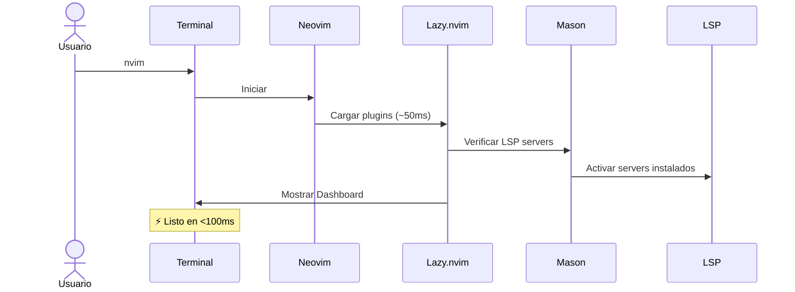

# Ariadna

[](https://opensource.org/licenses/MIT)
[](https://neovim.io/)
[](https://lazyvim.org/)
[](https://icarus.mx)

**Configuración profesional de Neovim lista en 3 minutos**

Ariadna es una distribución de [LazyVim](https://lazyvim.org) optimizada para desarrollo web moderno, con LSP servers pre-configurados, tema elegante y documentación completa en español. Diseñada especialmente para el stack de Icarus (SvelteKit 5 + Tailwind CSS 4 + JavaScript).

> "Salgamos de este laberinto" 🏛️

---

## ¿Por qué Ariadna?

La configuración de Neovim puede tomar **días de trabajo**. Ariadna te lo da todo listo:

- **Zero-Config**: Instala y empieza a programar, sin horas de configuración
- **Stack Moderno**: LSP para SvelteKit 5, Tailwind CSS 4, TypeScript, JavaScript
- **Documentación en Español**: Tutoriales, keybindings y ayuda en tu idioma
- **Rendimiento**: Carga en <100ms con lazy loading inteligente
- **Extensible**: Añade tus propios plugins fácilmente
- **Mantenido activamente**: Actualizaciones regulares con las últimas herramientas

---

## Instalación Rápida

```bash
bash <(curl -fsSL https://icarus.mx/ariadna/install.sh)
```

El instalador automáticamente:
- ✅ Verifica e instala Neovim si no lo tienes
- ✅ Detecta y previene problemas de permisos (common con sudo)
- ✅ Respalda tu configuración existente con timestamp
- ✅ Descarga la configuración de Ariadna
- ✅ Instala plugins y LSP servers automáticamente
- ✅ Valida Node.js y Git (necesarios para LSP)

**Tiempo total**: ~3 minutos (primera vez) | ~30 segundos (re-instalación)

**Flujo de instalación**: Ver [diagrama completo](docs/installation-flow.mmd) para detalles del proceso

### Instalación Manual

Si prefieres instalar paso a paso:

```bash
# 1. Clonar el repositorio
git clone https://github.com/icarus-mx/ariadna.git ~/.config/nvim

# 2. Abrir Neovim (instalará plugins automáticamente)
nvim

# 3. Esperar a que Mason instale LSP servers (~1 min)
# 4. Reiniciar Neovim
```

---

## Características

### Estética Profesional
- **Tema**: Kanagawa Wave con transparencia elegante
- **Dashboard**: Pantalla de bienvenida personalizada con logo ASCII
- **Iconos**: Nerd Fonts para una interfaz moderna
- **Statusline**: Información contextual sobre Git, LSP, archivo actual

### Optimizado para Desarrollo Web
- **SvelteKit 5**: Syntax highlighting avanzado + LSP completo + snippets
- **Tailwind CSS 4**: Autocompletado inteligente + preview de colores inline
- **TypeScript/JavaScript**: ESLint integrado + Prettier formatting + debugging
- **Markdown**: Renderizado inline + preview con Glow (Shift+L)

### Plugins Pre-configurados

| Plugin | Función | Keybinding |
|--------|---------|------------|
| **Telescope** | Búsqueda ultrarrápida de archivos y texto | `Space Space` |
| **Neo-tree** | Explorador de archivos con vista de árbol | `Space e` |
| **Lazygit** | Interfaz Git completa dentro de Neovim | `Space gg` |
| **Which-key** | Ayuda contextual de keybindings | `Space ?` |
| **Gitsigns** | Indicadores de Git en el gutter + preview | `]c` / `[c` |
| **Mason** | Gestión automática de LSP servers | `:Mason` |
| **Treesitter** | Syntax highlighting contextual | Automático |

### LSP Servers Incluidos

Ariadna instala automáticamente estos Language Server Protocols:

```lua
{
  "vtsls",                      -- TypeScript/JavaScript
  "svelte-language-server",      -- SvelteKit 5
  "tailwindcss-language-server", -- Tailwind CSS 4
  "prettier",                    -- Code formatter
  "eslint-lsp",                  -- JavaScript linter
  "stylua",                      -- Lua formatter
}
```

Esto te da:
- ✅ Autocompletado inteligente
- ✅ Diagnósticos en tiempo real
- ✅ Go to definition / references
- ✅ Refactoring automático
- ✅ Formatting al guardar

---

## Arquitectura

Ariadna está construido sobre una arquitectura modular que facilita la personalización:

```
~/.config/nvim/
├── init.lua                 # Punto de entrada (3 líneas)
└── lua/
    ├── config/              # Configuración base
    │   ├── lazy.lua         # Setup de Lazy.nvim
    │   ├── options.lua      # Opciones de Vim
    │   ├── keymaps.lua      # Atajos de teclado
    │   └── autocmds.lua     # Auto-comandos
    └── plugins/             # Plugins personalizados
        ├── ariadna.lua      # Dashboard + Mason config
        ├── colorscheme.lua  # Tema Kanagawa
        ├── svelte.lua       # SvelteKit support
        ├── tailwind.lua     # Tailwind CSS support
        ├── markdown.lua     # Markdown tools
        └── example.lua      # Plantilla para nuevos plugins
```

### Flujo de Inicio



**Documentación completa**: Ver [docs/system-architecture.mmd](docs/system-architecture.mmd) para diagrama detallado

---

## Uso Básico

### Keybindings Esenciales

Los atajos más importantes que debes memorizar:

```
NAVEGACIÓN
  Space Space    - Buscar archivos (Telescope)
  Space e        - Explorador de archivos (Neo-tree)
  Space /        - Buscar texto en proyecto (grep)
  Space h        - Ayuda de Neovim
  Ctrl-h/j/k/l   - Navegar entre ventanas

GIT
  Space gg       - Lazygit (interfaz Git completa)
  ]c / [c        - Siguiente/anterior cambio de Git
  Space gB       - Git blame (ver quién escribió la línea)

LSP (mientras editas código)
  gd             - Go to definition
  gr             - Find references
  K              - Hover documentation
  Space ca       - Code actions (refactoring)
  Space rn       - Rename variable/función

BUFFER MANAGEMENT
  Space bd       - Cerrar buffer actual
  [ b / ] b      - Buffer anterior/siguiente

MARKDOWN
  Shift-L        - Preview con Glow (solo .md)
```

### Flujo de Trabajo Típico

```bash
# 1. Abrir Neovim
nvim

# 2. Buscar archivo (Space Space)
# Escribes parte del nombre, Enter para abrir

# 3. Editar código
# - LSP te da autocompletado mientras escribes
# - Prettier formatea automáticamente al guardar (:w)
# - ESLint muestra errores en tiempo real

# 4. Commit con Lazygit (Space gg)
# - Interfaz visual completa de Git
# - Stage, commit, push sin salir de Neovim

# 5. Buscar en todo el proyecto (Space /)
# - Grep ultrarrápido con preview
```

---

## Personalización

### Añadir un Nuevo Plugin

Crea un archivo en `~/.config/nvim/lua/plugins/`:

```lua
-- ~/.config/nvim/lua/plugins/mi-plugin.lua
return {
  {
    "autor/nombre-del-plugin",
    event = "VeryLazy",  -- Lazy loading
    opts = {
      -- Configuración del plugin
    },
  },
}
```

**Reinicia Neovim** y Lazy.nvim instalará el plugin automáticamente.

### Cambiar el Tema

Edita `~/.config/nvim/lua/plugins/colorscheme.lua`:

```lua
return {
  {
    "rebelot/kanagawa.nvim",
    opts = {
      theme = "dragon",  -- Cambiar a 'dragon' o 'lotus'
      transparent = false,  -- Deshabilitar transparencia
    },
  },
}
```

### Añadir Keybindings Personalizados

Edita `~/.config/nvim/lua/config/keymaps.lua`:

```lua
local map = vim.keymap.set

-- Ejemplo: Space w para guardar
map("n", "<leader>w", ":w<CR>", { desc = "Guardar archivo" })
```

### Instalar más LSP Servers

Edita `~/.config/nvim/lua/plugins/ariadna.lua`:

```lua
{
  "williamboman/mason.nvim",
  opts = function(_, opts)
    vim.list_extend(opts.ensure_installed, {
      "rust-analyzer",  -- Añadir Rust
      "pyright",        -- Añadir Python
    })
  end,
}
```

---

## Requisitos del Sistema

### Requisitos Mínimos

- **Neovim**: >= 0.10.0 (se instala automáticamente si no lo tienes)
- **Git**: >= 2.19.0 (para clonar plugins)
- **Node.js**: >= 18.0.0 (para LSP servers de JavaScript/TypeScript)
- **Sistema Operativo**: macOS, Linux, Windows (WSL)

### Requisitos Opcionales

- **Nerd Font**: Para iconos (recomendado: JetBrains Mono Nerd Font)
- **Glow**: Para preview de Markdown (`brew install glow` en macOS)
- **ripgrep**: Para búsquedas ultrarrápidas (generalmente ya incluido)
- **fd**: Para búsqueda de archivos más rápida (opcional)

### Instalar Nerd Font (Recomendado)

Los iconos de Ariadna requieren una Nerd Font:

```bash
# macOS
brew tap homebrew/cask-fonts
brew install font-jetbrains-mono-nerd-font

# Linux (manual)
# Descarga de: https://www.nerdfonts.com/font-downloads
# Instala JetBrains Mono Nerd Font
```

Luego configura tu terminal para usar "JetBrainsMono Nerd Font".

---

## Troubleshooting

### Error: "Permission denied" al abrir Neovim

**Causa**: Ejecutaste el instalador con `sudo`, lo que crea archivos con permisos de root.

**Solución**:
```bash
# Eliminar configuración con permisos incorrectos
sudo rm -rf ~/.config/nvim ~/.local/share/nvim ~/.cache/nvim ~/.local/state/nvim

# Re-instalar SIN sudo
bash <(curl -fsSL https://icarus.mx/ariadna/install.sh)
```

### Plugins no se instalan

**Causa**: Git no está instalado o hay problemas de red.

**Solución**:
```bash
# Verificar Git
git --version

# Reinstalar plugins manualmente
nvim
:Lazy sync
```

### LSP no funciona en archivos .svelte

**Causa**: Node.js no está instalado o svelte-language-server falló.

**Solución**:
```bash
# Verificar Node.js
node --version  # Debe ser >= 18.0.0

# Reinstalar LSP server
nvim
:Mason
# Buscar "svelte-language-server" y reinstalar
```

### El tema no se ve bien

**Causa**: Tu terminal no soporta true color o no estás usando una Nerd Font.

**Solución**:
```bash
# Verificar soporte de colores
echo $TERM  # Debe ser xterm-256color o similar

# En tu terminal, habilita true color
# Para iTerm2: Preferences > Profiles > Terminal > Report Terminal Type = xterm-256color

# Instalar Nerd Font (ver sección Requisitos Opcionales)
```

### Problemas con permisos en ~/.cache

**Causa**: Directorio cache con owner incorrecto.

**Solución**:
```bash
# Verificar owner
ls -ld ~/.cache

# Si es root, cambiarlo
sudo chown -R $USER:$(id -gn) ~/.cache
```

---

## Actualizaciones

Ariadna se actualiza automáticamente con Lazy.nvim:

```vim
:Lazy sync
```

Esto actualiza:
- ✅ LazyVim core
- ✅ Todos los plugins
- ✅ Configuración de Ariadna (si clonaste el repo)

Para actualizar LSP servers:

```vim
:Mason
# Presiona 'U' para actualizar todos
```

---

## Desinstalación

Si quieres volver a tu configuración anterior:

```bash
# 1. Eliminar Ariadna
rm -rf ~/.config/nvim

# 2. Restaurar tu backup (si existe)
mv ~/.config/nvim.backup.YYYYMMDD_HHMMSS ~/.config/nvim

# 3. Limpiar datos de plugins
rm -rf ~/.local/share/nvim
rm -rf ~/.cache/nvim
rm -rf ~/.local/state/nvim
```

---

## Recursos de Aprendizaje

### Dentro de Neovim

```vim
:help ariadna           " Documentación completa de Ariadna
:Tutor                  " Tutorial interactivo de Vim
:checkhealth            " Verificar estado de Neovim
:LazyVim                " Documentación de LazyVim
```

### Documentación Externa

- **[LazyVim Docs](https://lazyvim.org)**: Distribución base de Ariadna
- **[Neovim Docs](https://neovim.io/doc)**: Documentación oficial
- **[ThePrimeagen - Vim Master](https://www.youtube.com/c/theprimeagen)**: Videos de Vim/Neovim
- **[TJ DeVries - Neovim Core](https://www.youtube.com/c/tjdevries)**: Configuración avanzada

### Comunidad Icarus

- **Discord**: [icarus.mx/discord](https://icarus.mx/discord)
- **Twitter**: [@icarus_mx](https://twitter.com/icarus_mx)
- **GitHub**: [github.com/icarus-mx](https://github.com/icarus-mx)

---

## Contribuir

Ariadna es open source y acepta contribuciones:

```bash
# 1. Fork el repositorio
# 2. Crea una rama para tu feature
git checkout -b feature/mi-mejora

# 3. Haz tus cambios
# 4. Commit con mensaje descriptivo
git commit -m "feat: añadir soporte para Python"

# 5. Push y crea un Pull Request
git push origin feature/mi-mejora
```

### Áreas donde ayudar:

- 📝 Mejorar documentación y tutoriales
- 🐛 Reportar bugs o problemas de instalación
- ✨ Sugerir nuevos plugins o LSP servers
- 🌍 Traducciones a otros idiomas
- 🎨 Mejoras al tema o dashboard

---

## Filosofía

Ariadna sigue estos principios:

1. **Zero-Config First**: Debe funcionar perfectamente sin configuración
2. **Stack-Specific**: Optimizado para tecnologías específicas, no genérico
3. **Educational**: Código documentado para que aprendas cómo funciona
4. **Performance Matters**: Cada plugin debe justificar su impacto en startup
5. **Spanish-First**: Documentación completa en español, sin compromisos

---

## Licencia

MIT License - ver [LICENSE](LICENSE) para detalles

Copyright (c) 2025 [Icarus](https://icarus.mx)

---

## Agradecimientos

Ariadna está construido sobre el trabajo de:

- **[LazyVim](https://lazyvim.org)** por [@folke](https://github.com/folke) - Distribución base excelente
- **[Lazy.nvim](https://github.com/folke/lazy.nvim)** - Gestor de plugins moderno
- **[Neovim](https://neovim.io)** - El mejor editor de texto
- **[Mason.nvim](https://github.com/williamboman/mason.nvim)** - LSP package manager
- **[Kanagawa.nvim](https://github.com/rebelot/kanagawa.nvim)** - Tema visual hermoso

---

<div align="center">

**Hecho con ❤️ por [Icarus](https://icarus.mx)**

*"Salgamos de este laberinto"* 🏛️

[Website](https://icarus.mx) • [Twitter](https://twitter.com/icarus_mx) • [GitHub](https://github.com/icarus-mx)

</div>
